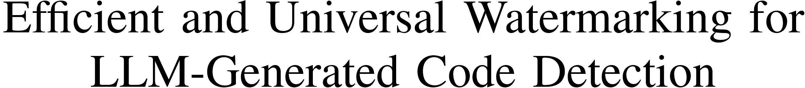
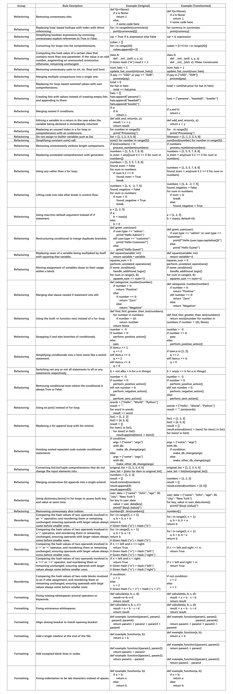
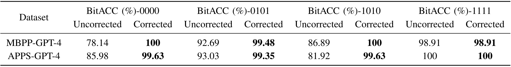

<p align="center">
     <a href="https://arxiv.org/abs/2402.07518">

     </a>
   <p align="center">
    <a><strong>Boquan Li<sup>1,2</sup></strong></a>
    .
    <a><strong>Zirui Fu<sup>1</sup></strong></a>
    .
    <a><strong>Mengdi Zhang<sup>2</sup></strong></a>
    .
    <a><strong>Peixin Zhang<sup>2</sup></strong></a>
    .
    <a><strong>Jun Sun<sup>2</sup></strong></a>
    .
    <a><strong>Xingmei Wang<sup>1</sup></strong></a>
   
    
<p align="center">
    <strong><sup>1</sup>Harbin Engineering University</strong> &nbsp;
    <strong><sup>2</sup>Singapore Management University</strong> &nbsp;
<p align="center">
    <a href='https://arxiv.org/abs/2402.07518'>
      
         </a>
  
## Overview of this repository
- [Abstract](#abstract)
- [Quick Start](#quick-start)
- [Appendix](#appendix)
    - [Transformation Rules](#transformation-rules)
    - [Multi-bit Watermarking](#multi-bit-watermarking)
- [Contact](#contact)

## Abstract


Large language models (LLMs) have significantly enhanced the usability of 
AI-generated code, providing effective assistance to programmers.
This advancement also raises ethical and legal concerns, 
such as academic dishonesty or the generation of malicious code.
For accountability, it is imperative to detect whether a piece of code is AI-generated.
Watermarking is broadly considered a promising solution and has been successfully applied to identify LLM-generated text. 
However, existing efforts on code are far from ideal, 
suffering from limited universality and excessive time and memory consumption.
In this work, we propose a plug-and-play watermarking approach for AI-generated code detection, 
named **ACW** (**A**I **C**ode **W**atermarking).
**ACW** is training-free and works by selectively applying a set of carefully-designed, 
semantic-preserving and idempotent code transformations to LLM code outputs.
The presence or absence of the transformations serves as implicit watermarks, 
enabling the detection of AI-generated code.
Our experimental results show that ACW effectively detects AI-generated code, 
preserves code utility, and is resilient against code optimizations.
Especially, **ACW** is efficient and is universal across different LLMs, 
addressing the limitations of existing approaches.

## Quick Start

We will share our code and data after email communications at present, and will fully open them after the official publication of this paper.

## Appendix

### Transformation Rules



### Multi-bit Watermarking

We explore the transferability of **ACW** applied for tracing LLMs, beyond our main task of AI-generated code detection.
By assigning multi-bit watermarks to encode different LLMs (e.g., ChatGPT-4 may be assigned with encoding $1011$), the authorship of a given code can be traced by identifying the extracted bit sequences.
Preliminary, we encode multi-bit watermarks based on the Bose-Chaudhuri-Hocquenghem (BCH) code, which is a typical error-correction code in digital communication systems.
Let $\omega$ be a $k$-bit binary sequence, a BCH code over Galois field $GF(q)$ with parameter $(l, k, e)$ denoted as $BCH(l, k, e)\_{q}$, which encodes $\omega$ into an $l$-bit sequence $\omega_{en}$.
The encoding is governed by a generator polynomial $g(x)$ which is the minimal polynomial over $GF(q)$, ensuring the original message $\omega$ can be recovered by decoding the encoded message $\omega_{en}$ if up to $e$ bits are corrupted.
For example, $BCH(7, 4, 1)_2$ uses a generator polynomial as $g(x) = x^3 + x + 1$, corresponding to the binary coefficients $1011$.

For watermark embedding, given an AI-generated code snippet $\mathcal{C}$ and an applicable transformation set $T$, **ACW** embeds an $l$-bit watermark to $\mathcal{C}$ by selectively applying $l$ applicable transformations from $T$, corresponding to their bit positions in $\omega$ (encoded based on BCH).
If the bit value in a position is $0$, the corresponding transformation will be applied to the code. If the bit value is $0$, the transformation will be skipped.

For watermark extraction, **ACW** checks the application status of $l$ applicable transformations.
If a certain transformation has been applied, it is determined bit value $1$, otherwise, $0$.
Finally, a multi-bit watermark $w_{ex}$ can be extracted as a bit sequence.
Note that BCH allows us to correct possible wrongly-extracted watermark bits, where the error tolerance is determined by the parameter $e$ in BCH.

We empirically evaluate the correctness of **ACW** in extracting multi-bit watermarks in terms of Bit Accuracy (BitACC).
Given a set of watermarked codes, BitACC refers to the proportion of the codes whose encoded watermarks are correctly extracted, among the total.
In particular, we consider the watermark in a certain code snippet to be correctly extracted, only if the extracted watermark matches the original watermark (in bit) exactly.




<div align="center">

Table 1: Multi-bit Watermark Extraction Results.

</div>

The above table presents our results.
Following our error-correction strategies, 
in this experiment, we collect the watermarked codes with four applicable transformations in MBPP-GPT-4 and APPS-GPT-4 datasets, 
i.e., each code snippet is embedded with 4-bit watermarks, 
where the first two bits are original watermarks and the next two bits are generated based on BCH.
We present the BitACC results before and after error corrections, 
where the former uncorrected ones are intermediate results for comparisons.
As shown by the result, **ACW** achieves promising performance on watermark extraction, 
and the results are significantly increased based on error correction.
Especially, as the bold values in the table, all the BitACC results are over 98\% after correction, 
indicating that **ACW** has the ability to embed and extract multi-bit watermarks, 
and has the potential to be applied to more tasks beyond AI-generated code detection. 

## Contact
We are looking forward to any valuable questions or suggestions, please feel free to contact us at ```noelle@hrbeu.edu.cn```
